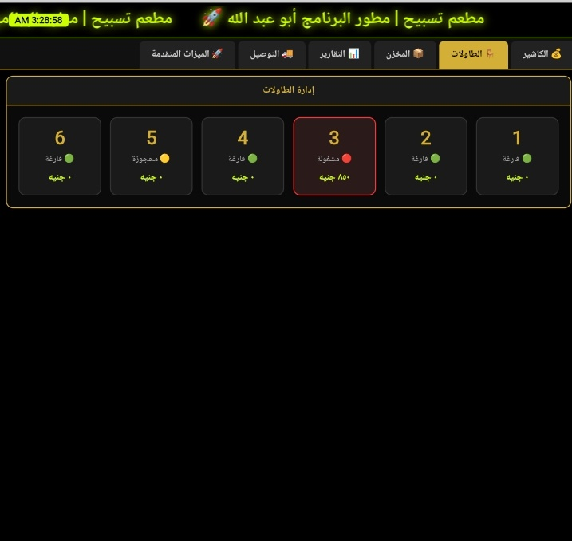
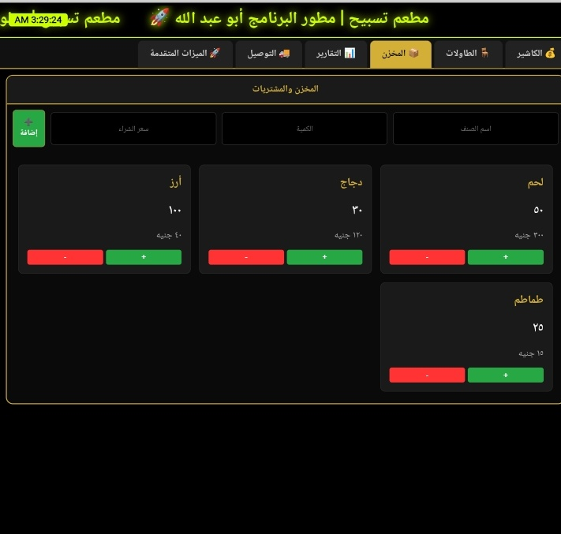
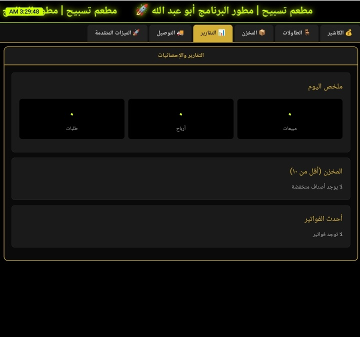
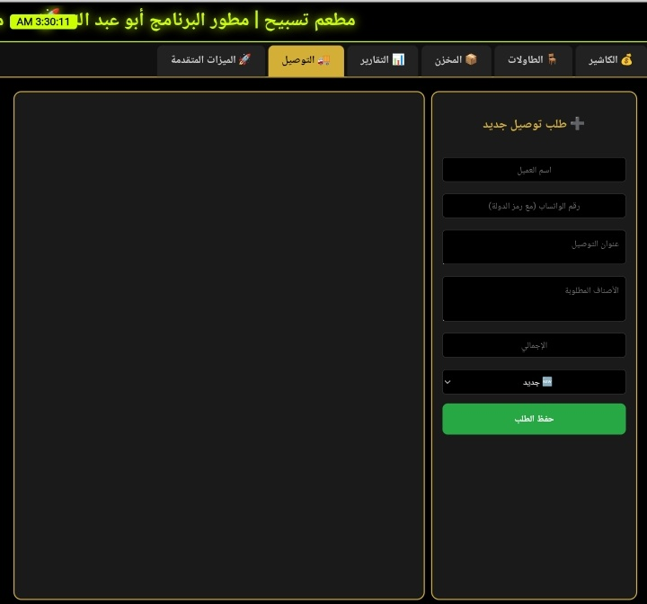

<!DOCTYPE html>
<html lang="ar" dir="rtl">
<head>
    <meta charset="UTF-8">
    <title>نظام مطعم تسبيح 2026</title>
    
</head>
<body>
    <h1>🚀 نظام مطعم تسبيح المتكامل 2026</h1>
    
تطوير: أبو عبد الله

    

        <h2>🟢 نظام الكاشير (POS)</h2>
        
    

    

        <h2>🔴 إدارة المبيعات</h2>
        
    

    

        <h2>🟡 المخزن والجرد</h2>
        
    

    

        <h2>🔵 التقارير اليومية</h2>
        
    

    

        <h2>📊 واجهة النظام</h2>
        
    

</body>
</html>
